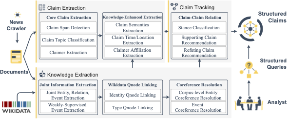

# COVID-19 Claim Radar: A Structured Claim Extraction and Tracking System

## Table of Contents
=================
  * [Overview](#overview)
  * [Requirements](#requirements)
  * [Data](#data)
  * [Code](#code)

## Overview

<p align="center">
  
</p>

The COVID-19 pandemic has received extensive media coverage, with a vast variety of claims made about different aspects of the virus. In order to track these claims,  we present [COVID-19 Claim Radar](https://blenderdemo.com/covid-list), a system that automatically extracts claims relating to COVID-19 in news articles.
We provide a comprehensive structured view of such claims, with rich attributes (such as claimers and their affiliations) and associated knowledge elements (such as events, relations and entities). 
Further, we use this knowledge to identify inter-claim connections such as equivalent, supporting, or refuting relations, with shared structural evidence like  claimers, similar centroid events and arguments. 
In order to consolidate claim structures at the corpus-level, we leverage [Wikidata](https://www.wikidata.org) as the hub to merge coreferential knowledge elements, and apply machine translation to aggregate claims from news articles in multiple languages. The system provides users with a comprehensive exposure to COVID-19 related claims, their associated knowledge elements, and related connections to other claims. 
The system is publicly available on [GitHub](https://github.com/uiucnlp/covid-claim-radar) and [DockerHub](https://hub.docker.com/repository/docker/blendernlp/covid-claim-radar), with instructional [video](http://blender.cs.illinois.edu/aida/covid_claim_radar.mp4).

## Demos

- Claim Radar Demo: https://blenderdemo.com/covid-list
- Ukraine Radar Demo (Old data): https://blenderdemo.com/ukraine-list
- Ukraine Radar Demo (New data): https://blenderdemo.com/ukraine-list-new

- Claim Radar Real Time Extraction: https://blenderdemo.com/covid-extract
- Ukraine Radar Real Time Extraction: https://blenderdemo.com/ukraine-extract

- SmartBook: https://blenderdemo.com/smartbook


## Requirements

### Docker
The docker is `blendernlp/covid-claim-radar`. 

### GPU support
Please provide GPU ids in the running script `extract.sh`.

## Data

Our experimental data is LDC2021E11. 

## Code

### Code Structure

`claim_detection`: code for claim detection system
`knowledge_extraction`: code for knowledge extraction system
`api`: code for live extraction API (https://blenderdemo.com/covid-list)[https://blenderdemo.com/covid-list]
`demo`: code for result visualization demo (https://blenderdemo.com/covid-extract)[https://blenderdemo.com/covid-extract]
`data`: sample data


Step 1:
Tokenize raw text RSD files into LTF files. 
Prepare a data directory data containing sub-directories rsd and ltf. The rsd sub-directory contains RSD (Raw Source Data, ending with *.rsd.txt), and ltf sub-directory has LTF (Logical Text Format, ending with *.ltf.xml) files.
If you have RSD files, please use the aida_utilities/rsd2ltf.py to generate the LTF files.
```
docker run --rm -v ${ltf_dir}:${ltf_dir} -v ${rsd_dir}:${rsd_dir} -i limanling/uiuc_ie_m36 /opt/conda/envs/py36/bin/python /aida_utilities/rsd2ltf.py --seg_option nltk+linebreak --tok_option nltk_wordpunct --extension .rsd.txt ${rsd_dir} ${ltf_dir}
```
If you have LTF files, please use the AIDA ltf2rsd tool (LDC2018E62_AIDA_Month_9_Pilot_Eval_Corpus_V1.0/tools/ltf2txt/ltf2rsd.perl) to generate the RSD files.

Step 2:
Please find the claim extraction and claim-claim relation detection code under `claim_detection`, and knowledge extraction code under `knowledge_extraction`. 

The example running command is:
```
sh extract.sh ${lang} ${data_root} ${query_root} ${parent_child_tab_path} ${gpu_device}
```
where `${data_root}` is the directory contains ltf and rsd subdirectories, `${query_root}` is the claim query directory from LDC (such as `Condition 5`), `${parent_child_tab_path}` is the file name mapping from LDC.

If using the sample data in `data` directory: 
```
sh extract.sh en /shared/nas/data/m1/manling2/aida_docker_test/covid-claim-radar/data/test_en /shared/nas/data/m1/manling2/aida_docker_test/covid-claim-radar/data/AIDA_Phase3_TA3_Dry_Run_Queries/Condition5 /shared/nas/data/m1/manling2/aida_docker_test/covid-claim-radar/data/test_en/parent_children.tab 0
```
